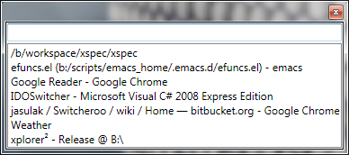

 Switcheroo  [](https://ci.appveyor.com/project/kvakulo/switcheroo) 
==========

Switcheroo is for anyone who spends more time using a keyboard than a mouse.
Instead of alt-tabbing through a (long) list of open windows, Switcheroo allows
you to quickly switch to any window by typing in just a few characters of its title.

## Screenshot




Download
--------

**[Download Switcheroo here](https://github.com/kvakulo/Switcheroo/releases)**

If you use [Chocolatey](https://chocolatey.org), Switcheroo can be installed with `choco install switcheroo`.


Usage
-----

Action                         | Shortcut        | Remarks
------------------------------ | --------------- | ----------
Activate Switcheroo            | `Alt + Space`   | This shortcut can be customized in _Options_
Activate Switcheroo            | `Alt + Tab`     | Only works if enabled under _Options_
_When Switcheroo is open_      |                 |
Switch to selected window      | `Enter`         |
Close selected window          | `Ctrl + W`      |
Dismiss Switcheroo             | `Esc`           |


History
---------

Switcheroo was originally developed by [James Sulak](https://github.com/jsulak).

[Regin Larsen](https://github.com/kvakulo) took over the project in 2014 and is the current maintainer.


How to contribute
-----------------

Please report any bug you encounter by [submitting an issue](https://github.com/kvakulo/Switcheroo/issues/new).

If you have an idea how to improve Switcheroo, then don't be shy to submit it as well.

Pull requests are greatly appreciated. If you plan a larger feature, then please get in contact, so we can coordinate the efforts.


License
-------

Switcheroo is open source and is licensed under the [GNU GPL v. 3](http://www.gnu.org/licenses/gpl.html).

```
Copyright 2014, 2015 Regin Larsen
Copyright 2009, 2010 James Sulak
 
Switcheroo is free software: you can redistribute it and/or modify
it under the terms of the GNU General Public License as published by
the Free Software Foundation, either version 3 of the License, or
(at your option) any later version.

Switcheroo is distributed in the hope that it will be useful,
but WITHOUT ANY WARRANTY; without even the implied warranty of
MERCHANTABILITY or FITNESS FOR A PARTICULAR PURPOSE.  See the
GNU General Public License for more details.
 
You should have received a copy of the GNU General Public License
along with Switcheroo.  If not, see <http://www.gnu.org/licenses/>.
```


Credits
-------

[HellBrick](https://github.com/HellBrick), [ovesen](https://github.com/ovesen), [philippotto](https://github.com/philippotto), [tarikguney](https://github.com/tarikguney), [holymoo](https://github.com/holymoo), [elig0n](https://github.com/elig0n), [trond-snekvik](https://github.com/trond-snekvik), and [daanzu](https://github.com/daanzu) have contributed to Switcheroo.

Switcheroo makes use of these great open source projects:

* [Managed Windows API](http://mwinapi.sourceforge.net), Copyright © 2006 Michael Schier, GNU Lesser General Public License (LGPL)
* [PortableSettingsProvider](https://github.com/crdx/PortableSettingsProvider), Copyright © crdx, The MIT License (MIT)
